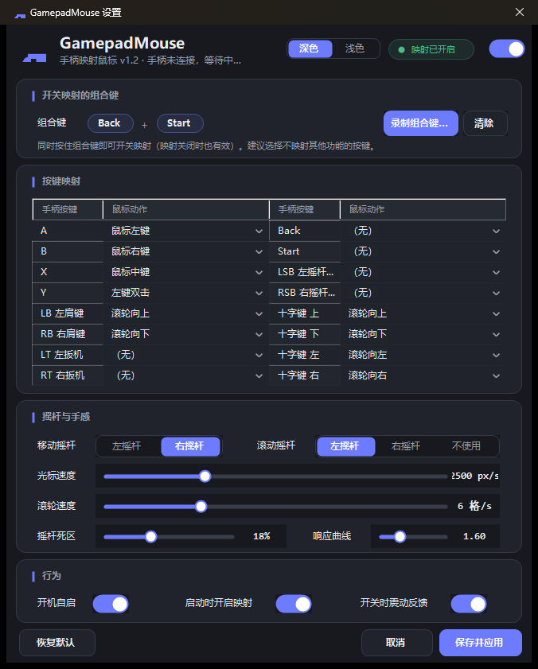
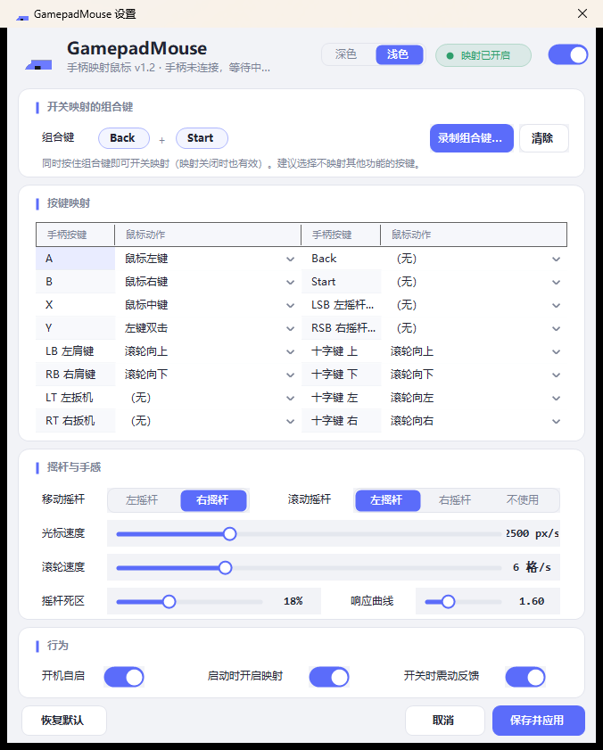

# GamepadMouse（手柄映射鼠标）

[](https://github.com/StoneBeast/gamepad-mouse/releases)
[](https://github.com/StoneBeast/gamepad-mouse/actions/workflows/build.yml)

<p align="center">
  
</p>

一个 Windows 后台托盘程序：把手柄（XInput 手柄）映射为鼠标使用，**映射的开关完全由手柄上的组合键/按键完成**，所有按键映射和参数均可自定义，无需依赖键盘鼠标即可全程操作。

## 下载安装

到 [Releases](https://github.com/StoneBeast/gamepad-mouse/releases) 页面获取（**无需安装 .NET 运行时**）：

| 文件 | 说明 |
|---|---|
| `GamepadMouse-x.y.z-portable.zip` | **便携版**：解压即用的单个 exe |
| `GamepadMouse-setup-x.y.z.exe` | **安装包**：中文向导、免管理员权限（按用户安装），含开始菜单/桌面快捷方式，支持卸载 |

## 功能特性

- **手柄 → 鼠标**：摇杆控制光标移动（死区 + 响应曲线整形），按键模拟左/右/中键点击、双击、滚轮上下左右滚动。
- **组合键开关映射**：默认按住 `Back + Start` 切换映射开/关（可录制为任意按键组合），开关时手柄震动提示；也可以把任意单个按键映射为「开关映射」动作。
- **全量自定义**：16 个手柄按键（A/B/X/Y、LB/RB、LT/RT、Back/Start、LSB/RSB、十字键）都可映射为任意鼠标动作；移动/滚动摇杆可互换；灵敏度、死区、响应曲线、轮询间隔、扳机阈值均可调。
- **深色现代设置界面**：双击托盘图标打开（或 `GamepadMouse.exe --settings`），点任务栏图标可最小化/还原窗口，自绘圆角卡片 / 拨动开关 / 滑杆 / 分段选择器，支持直接在手柄上「录制」组合键；**深色 / 浅色双主题**一键切换（含标题栏），即时生效并记忆。




- **后台常驻**：托盘图标运行，右键菜单可开关映射、开机自启、打开设置或「关于」窗口（可查询 GitHub Releases 检查更新）、退出。
- **配置持久化**：JSON 配置文件存于程序所在目录（便携式，随目录迁移；目录不可写时自动回退 `%APPDATA%`），修改后即时生效。
- **安全细节**：映射关闭/手柄断开/程序退出时自动释放按住的鼠标键，不会出现"卡键"。

## 环境要求

- Windows 10/11（x64）
- .NET 8 桌面运行时（自包含发布的单文件版本无需安装）
- XInput 模式的手柄（Xbox 手柄及绝大多数以 XInput/360 模式连接的手柄）

## 快速开始

### 方式一：使用预构建产物（自己构建一次）

```powershell
# 在仓库根目录执行
.\scripts\build.ps1              # 构建（需要 .NET 8 桌面运行时）
.\scripts\build.ps1 -Publish     # 或发布自包含单文件 exe（运行时已打包，拷贝即用）
```

运行 `src\GamepadMouse\bin\Release\net8.0-windows\GamepadMouse.exe`（或发布目录中的单文件 exe），程序出现在系统托盘。

> 需要 .NET 8 SDK；未安装时可参考官方 [dotnet-install 脚本](https://dot.net/v1/dotnet-install.ps1)安装 8.0 版本。

## 默认按键映射

| 手柄按键 | 鼠标动作 |
|---|---|
| 右摇杆 | 移动光标 |
| 左摇杆 | 滚轮滚动 / 水平滚动 |
| A | 鼠标左键（按住拖拽） |
| B | 鼠标右键 |
| X | 鼠标中键 |
| Y | 左键双击 |
| LB / RB | 滚轮上 / 下 |
| 十字键上/下/左/右 | 滚轮上/下/左/右 |
| Back + Start | **开/关映射（组合键）** |

> 建议：组合键选择平时不映射其他功能的按键（默认的 Back+Start），避免误触发。

## 配置文件

路径：程序所在目录下的 `config.json`（首次运行自动生成；设置界面保存后也会更新；老版本在 `%APPDATA%` 的配置会自动迁移）。示例：

```json
{
  "ToggleChord": [ "Back", "Start" ],   // 开关映射的组合键
  "MoveStick": "Right",                 // 移动光标的摇杆：Left/Right
  "ScrollStick": "Left",                // 滚动摇杆：Left/Right/None
  "Sensitivity": 2500,                  // 光标速度（像素/秒）
  "ScrollSensitivity": 6,               // 滚轮速度（格/秒，满偏移）
  "SmoothWheel": true,                  // 滚轮平滑模式（轻推慢滚、重推快滚）
  "Deadzone": 0.18,                     // 摇杆死区
  "Curve": 1.6,                         // 响应曲线指数（越大小幅度越精细）
  "PollRateMs": 8,                      // 轮询间隔
  "TriggerThreshold": 64,               // 扳机判定阈值
  "Theme": "Dark",                      // 界面主题：Dark / Light
  "StartEnabled": true,                 // 启动时自动开启映射
  "VibrateOnToggle": true,              // 开关映射时震动提示
  "ButtonMappings": {
    "A": "LeftClick",
    "B": "RightClick",
    "...": "..."
  }
}
```

可用动作：`None`、`LeftClick`、`RightClick`、`MiddleClick`、`WheelUp`、`WheelDown`、`WheelLeft`、`WheelRight`、`DoubleLeftClick`、`ToggleMapping`。

更多细节见 [docs/使用说明.md](docs/使用说明.md)。

## 常见问题

- **手柄没反应？** 确认手柄为 XInput 模式（很多手柄有 XInput/DirectInput 切换开关）；托盘悬停可查看连接状态；日志见 `log.txt（程序所在目录）`。
- **控制管理员权限的窗口无效？** Windows 的 UIPI 限制，请以管理员身份运行本程序。
- **光标移动太快/太慢？** 调整「光标速度」或「响应曲线」；小幅移动难控制时增大死区。
- **按组合键误触发了映射的按键？** 组合键与单键映射独立生效，请选择不常用按键作为组合键。

## License

MIT
